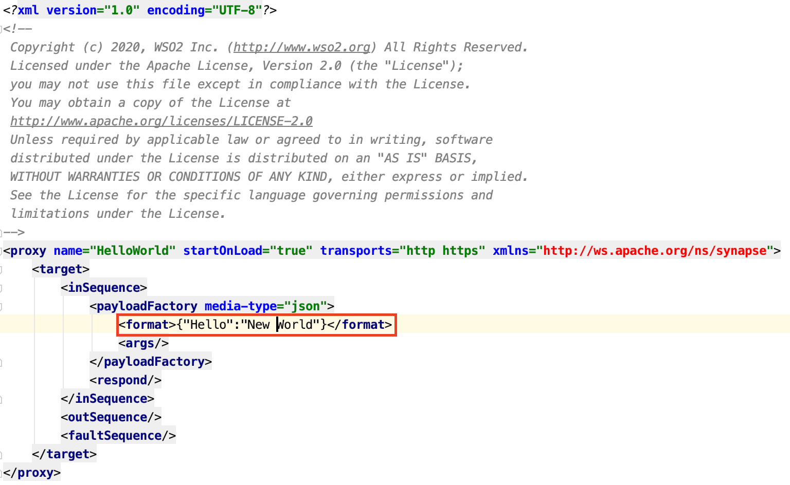
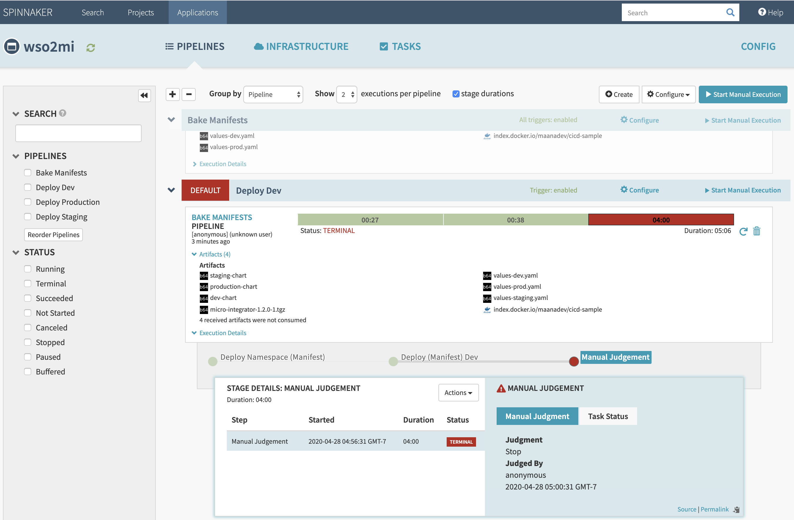

# Deploy Your Own Artifact
1.  Fork the [CICD sample](https://github.com/wso2-incubator/cicd-sample-docker-mi) repository which contains a [Maven
    Multi-Module
    project](https://ei.docs.wso2.com/en/latest/micro-integrator/develop/create-multi-maven-project/).

2.  Update the repositories in the  [sample values](https://raw.githubusercontent.com/wso2/kubernetes-pipeline/master/samples/values-mi.yaml) file
    used in the  [Quick Start Guide](/setup/deployment/k8s-pipeline/quick-start-guide/) to
    include the forked repository in place of `<ORGANIZATION_NAME>` as
    highlighted below.
    
    ``` xml
    applications:
      - name: wso2mi
        email: <EMAIL>
        testScript:
          path: tests
          command: test.sh
        chart:
          customChart: false
          name: micro-integrator
          version: 1.2.0-1
          repo: 'https://github.com/wso2-incubator/cicd-sample-chart-mi'
        images:
          - organization: *reg_username
            repository: wso2mi
            deployment: wso2microIntegrator
            customImage:
              baseImage: 'wso2/wso2mi:1.2.0'
              dockerfileGitRepo: 'https://github.com/<ORGANIZATION_NAME>/cicd-sample-docker-mi'
    ```

3.  Upgrade the Helm chart with the command below.
    
    ``` xml
    $ helm upgrade <RELEASE_NAME> wso2/kubernetes-pipeline -f values-mi.yaml
    ```

    !!! Info
        This may take up to 10 minutes.


4.  Restart the Jenkins pod by deleting the existing pods. This will
    cause the cluster to spawn a new pod for Jenkins.
    
    ``` xml
    $ POD_NAME=`kubectl get pods --selector=app=jenkins -n <NAMESPACE> -o 
    json -o jsonpath='{ .items[0].metadata.name }'`
    
    $ kubectl delete pod $POD_NAME -n <NAMESPACE>
    ```
    
    Replace **<NAMESPACE\>** with the namespace in your cluster.

5.  Create a clone of the forked artifact source repository as follows:

    ``` xml
    $ git clone https://github.com/<ORGANIZATION_NAME>/cicd-sample-docker-mi.git
    ```
    
    Replace the **<ORGANIZATION_NAME\>** tag with the name of your
    GitHub organization.

6.  Modify the Proxy service located at
    **cicd-sample-docker-mi > helloworld/src/main/synapse-config/proxy-services/HelloWorld.xml** to
    return a new response as bellow,
    
    [ ](../../../assets/img/k8s_pipeline/Deploying/deploy-mi1.png)

7.  Commit and push the changes into your forked repository.

8.  If you have completed the steps in [Testing The Pipeline
    Environment](/setup/deployment/k8s-pipeline/testing-the-pipeline-environment/) document,
    stop the manual judgment and watch the sample artifact being deployed in the Spinnaker dashboard.
    
    [](../../../assets/img/k8s_pipeline/Deploying/deploy-mi2.png)
    [](../../../assets/img/k8s_pipeline/Deploying/deploy-mi3.png)
    [](../../../assets/img/k8s_pipeline/Deploying/deploy-mi4.png)

9.  Invoke the service 
    
    ``` bash
    curl -k https://wso2mi-dev/services/HelloWorld  
    ```


10. You will get the following response: `{"Hello":"New World"}`
